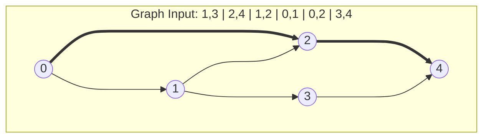

## More parameters vs more tokens

<!-- ### The power of *Large* _Language Models_ -->

Bender et al. <d-cite key="bender2021parrots"></d-cite> introduced the “stochastic parrot” metaphor to describe large language models (LLMs). They characterize an LM as “a system that randomly pieces together linguistic patterns it has encountered in massive training data, guided only by statistical cues about how those patterns co-occur, and without any grounding in meaning — essentially, a stochastic parrot.” While this description is accurate in that LLMs are trained by minimizing cross-entropy loss, this objective alone does not fully account for the range of behaviors these models exhibit.

{% include figure.liquid loading="eager" path="assets/img/gpt3_arithmetic.png" class="img-fluid" caption="Adapted from Figure 3.10 in the GPT-3 paper (Brown et al., 2020). A dramatic increase in capabilities is observed from the 13B model to the 175B model (from 9.2% to 94.2% accuracy in 3-digit subtraction)."%}

According to the GPT-3 paper <d-cite key="brown2020language"></d-cite>, the 175B model is only slightly more accurate than the 13B model in terms of next-token prediction (cross-entropy 1.73 vs. 1.97, or predicting the next token with 17.7% rather than 14% probability). Yet despite this modest improvement in perplexity, the 175B model is qualitatively far more capable: it solves many tasks almost perfectly, whereas the 13B model performs only marginally better than chance.

As mentioned in a talk by **Hyung Won Chung** from OpenAI <d-cite key="hyung2023incentivize"></d-cite>:  
> “Somehow the model learns to perform many, many tasks only trained with next-token prediction.”

In the same talk, he proposed the **massive multitask learning hypothesis**:  
> “Beyond some scale, the easiest way to do well on next-token prediction is for the model to find a set of general skills that are applicable to many tasks. For example, these skills include learning languages, understanding, and reasoning.”

Recently, there is a new axis of scaling these models: test-time compute. In this scaling regime, pass@1 performance on many tasks gets much better as we add more test-time compute.



So what does scaling up test-time compute mean in this context? There are a lot of examples where increasing test-time compute (i.e., doing more work at inference/test time rather than training time) leads to better performance in traditional algorithms - long before LLMs.

- Best-First or A Search*: Expanding more nodes → closer to optimal path.
- Monte Carlo Tree Search (MCTS): More playouts → deeper/denser search tree → stronger move choices.
- Beam Search in Decoders (e.g., HMMs, CRFs, SMT): increase beam width → examine more candidate sequences.
- k-Nearest Neighbors (k-NN): Higher k often reduces noise → better predictive performance (up to a point).
- Markov Chain Monte Carlo (MCMC): More MCMC samples → better posterior estimates.


“Scaling test-time compute” in LLMs means: Allocating more computation during inference - without retraining the model — to get higher accuracy, better reasoning, or more reliable outputs.

In LLM inference, test-time compute often refer to number of tokens generated (More tokens = more test-time FLOPs). And scaling the test-time compute can be achieved via 
- Chain-of-thought (CoT)
- Self-consistency: sample many CoT paths
- Tree-of-thoughts search
- Reflection loops / Re-evaluation or verification passes
- Reasoning models

However, different from previous examples, why does this help is often not very clear.

Let's go thought some of them.

### From Standard Prompting, to Chain-of-Thought, to Reasoning trace

>*"The process of drawing conclusions based on available information (usually a set of premises)."*

In this article, we refer to "reasoning in LLMs" as the act of generating intermediate *steps* before arriving to the final answer. This could be achieved via 
* **Chain-of-thought with Prompting:** Prompt LMs such that they generate intermediate tokens/steps before the final answer.
* **Chain-of-thought without Prompting:** Select a decoding path where the model "reason" before answering.
* **Reasoning via RLVF or Distillation:** Post-finetuning LMs to reinforce generating reasoning behaviors.

The first and second approaches are actually very similar. Both try to steer the generation using input context. And they suggest that the base/instruct models are capable of reasoning with language to some extend.

Furthermore, LLMs could be finetuned such that they generate reasoning behaviors when solving problems. These reasoning behaviors could be initialization, deduction, knowledge augmentation, example testing, uncertainty estimation, and backtracking, e.t.c <d-cite key="venhoff2025understanding, mondorf2024beyond"></d-cite>. And by combining these behaviors, these models can achieve good performance on many complex tasks.

#### 1. From Standard Prompting to Chain-of-Thought Prompting
The following is an example from <d-cite key="wei2022chain"></d-cite> that ilustrate chain of thought from LLMs and the performance gains across different model families and model sizes:

| | **Standard Prompting** | **Chain-of-Thought Prompting** |
| :--- | :--- | :--- |
| **Model Input** | **Q:** Roger has 5 tennis balls. He buys 2 more cans of tennis balls. Each can has 3 tennis balls. How many tennis balls does he have now?<br><br>**A:** The answer is 11.<br><br>**Q:** The cafeteria had 23 apples. If they used 20 to make lunch and bought 6 more, how many apples do they have? | **Q:** Roger has 5 tennis balls. He buys 2 more cans of tennis balls. Each can has 3 tennis balls. How many tennis balls does he have now?<br><br>**A:** <span style="background-color:#ADD8E6;">Roger started with 5 balls. 2 cans of 3 tennis balls each is 6 tennis balls. 5 + 6 = 11.</span> The answer is 11.<br><br>**Q:** The cafeteria had 23 apples. If they used 20 to make lunch and bought 6 more, how many apples do they have? |
| **Model Output** | **A:** The answer is 27. <span style="color:red;font-size:1.5em;">✕</span> | **A:** <span style="background-color:#90EE90;">The cafeteria had 23 apples originally. They used 20 to make lunch. So they had 23 - 20 = 3. They bought 6 more apples, so they have 3 + 6 = 9.</span> The answer is 9. <span style="color:green;font-size:1.5em;">✓</span> |

<aside>

</aside>

This example uses 1-shot prompt, which includes an example of CoT in the prompt as demonstration. But in practice, including a simple instruction like "think step-by-step" has a similar effect.

There are several works that try to give a deeper understand of why does this improve the performance <d-cite key="prystawski2023why"></d-cite>. Some give explainations based on the required computation to solve the problem. However, even if we only consider set of questions that *do not require many computation*, CoT prompting still improve the performance. So there should be more than that.




> Hypothesis 1: Chain of thought is a better estimator for locality structure

Consider the following theoretical setting:

- (A sequence of lenght N) A set of random variables $\{Y_i\}_{i = 1}^N$ taking support on a finite set $\mathcal{X}$
- $p_d$ is the data distribution defined by a Bayes net. 
- Training data is a sequence of variable indices $i \in \{ 1,\dots,N \}$, and variable values $v_i \in \mathcal{X}$ in the format `<indice>:<value>`.
- Observation distribution $p_\text{obs}$ takes support on a set $\mathcal{Y}_\text{obs} \subseteq \mathcal{P}(\{1,\dots,N\})$.
- Given an autoregressive conditional probability estimation model $q$, We can have the following estimators:
  1. Direct prediction: $\hat{q}_D(Y_i = y_i \| Y_j = y_j) = q(Y_i = y_i \| Y_j = y_j)$
  2. Scaffolded generation: 
    $$\hat{q}_S(Y_i = y_i \| Y_j = y_j) = \frac{1}{M} \sum_{k=1}^{M} q(Y_i = y_i \| \{Y_s = y_s^{k}\}_{s \in S} ,Y_j = y_j)$$ 
    where $$y_s^{k} \sim q(Y_s\| \{Y_t = y_t^{k}\}_{t \in S\|t \prec s} ,Y_j = y_j)$$
  3. Free generation

**Theorem 3.1.**  
Let $S$ be the space of possible sequences consisting of variable indices followed by variable values. Let $u$ be the uniform distribution over $S$. Let $H(p, q)$ denote the cross entropy between distributions $p$ and $q$. We consider the following risk:

$$
R(q) = H(p, q) + H(u, q).
$$

Let $q^{*} = \arg\min_{q} R(q)$ be a minimizer of the risk over all possible probability distributions. Then, for all non-adjacent random variables $Y_i$ and $Y_j$, reasoning through intermediate variables has lower bias than direct prediction. That is, for any $y_i, y_j \in \mathcal{X}$:

$$
\begin{aligned}
\left|
\mathbb{E}_{S \sim q^{*}}\!\left[ \hat{q}_S(Y_i = y_i \mid Y_j = y_j) \right]
- p_d(Y_i = y_i \mid Y_j = y_j)
\right|^2
&< \\
\left|
\hat{q}_D(Y_i = y_i \mid Y_j = y_j)
- p_d(Y_i = y_i \mid Y_j = y_j)
\right|^2.
\end{aligned}
$$

> Hypothesis 2: Chain of thought is easier to learn for autoregressive language models.

Some tasks are easier to learn and generalize than the others. 



The failure case of CoT:



In the above example, we ask GPT-4 to answer the value of a variable given chain of equations. The final result is correct but is this it? The answer start in the wrong direction and then come back to the correct branch. So there are 2 redundant steps. 

It seems like the model should have the ability to backtrack.


#### 2. From Chain-of-Thought Prompting to Reasoning trace

| | **Chain-of-Thought Prompting** | **Large Reasoning Models** <br>*(e.g., o1, R1)* |
| :--- | :--- | :--- |
| **Model Input** | **Q:** Roger has 5 tennis balls. He buys 2 more cans of tennis balls. Each can has 3 tennis balls. How many tennis balls does he have now?<br><br>**A:** <span style="background-color:#ADD8E6;">Roger started with 5 balls. 2 cans of 3 tennis balls each is 6 tennis balls. 5 + 6 = 11.</span> The answer is 11.<br><br>**Q:** The cafeteria had 23 apples. If they used 20 to make lunch and bought 6 more, how many apples do they have? | **Q:** The cafeteria had 23 apples. If they used 20 to make lunch and bought 6 more, how many apples do they have?<br><br>*(Input is simple; the complexity is handled by the model's hidden chain of thought)* |
| **Model Output** | **A:** <span style="background-color:#90EE90;">The cafeteria had 23 apples originally. They used 20 to make lunch. So they had 23 - 20 = 3. They bought 6 more apples, so they have 3 + 6 = 9.</span> The answer is 9. <span style="color:green;font-size:1.5em;">✓</span> | **A:** <span style="color:grey; font-style:italic;">&#9432; Thought Process (Internal)<br>1. Initial calc: 23 - 20 = 13...<br>2. <span style="color:#d9534f;"><strong>Wait, checking arithmetic:</strong></span> 23 minus 10 is 13. 23 minus 20 is 3. <br>3. <strong>Correction:</strong> The remaining amount is 3, not 13.<br>4. Add purchase: 3 + 6 = 9.<br>5. <strong>Final Verify:</strong> Does the question imply the 6 were bought *before* lunch? No, usually sequential. Answer holds.</span><br><br>The answer is 9. <span style="color:green;font-size:1.5em;">✓</span> |

Even thought, with CoT prompting, LLMs will break down the problem into steps, it often reflects *a final solution* which means that the "thought" does not includes common behaviors in human's reasoning process such as uncertainty expression, verification, or backtracking. 

However, these behaviors can emerge via RLVE finetuning. The resulted models, called Large Reasoning Models, generate answer in a 2 phases: the thinking phase where the generation shows different reasoning behaviors, and the conclusion phase.

<!-- *(Reasoning Behavior). The system’s computed response to a reasoning task, particularly its actions, expressions and underlying mechanisms exhibited during **the reasoning process**.*  -->

### LLM Monkey

## Research Questions

Our main question is 
> When reasoning models perform a certain reasoning behavior (e.g. verification), why do they chose to generate that step?

In another words, we aim to understand the underlying mechanism in these models: the debate between reasoning pattern or genuine reasoning. 

An example of genuine reasoning is when people get stuck in solving math problem, they response with a targeted adjustment instead of wild guesses.

Answering this question could give us insight into mitigating overthinking or enhancing reasoning capability of these models.

To better understand this question, we will walk thought several scenarios:

---

**Scenario 1: A toy example - BFS**

In this section, we "approximate" the learning to reasoning with learning to search. 
To illustrate this approximation, let's consider the process of solving mathematical problems. 
A language reasoning process starts with the initial state which includes question, axioms/heuristics, and a set of information. At each step, the thinking process transforms to a new state via reasoning behaviors.

This approach is similar to <d-cite key="saparov2025transformers"></d-cite>. 

LLMs can learn to mimic the search process and achieve better performance on specific graph search problems  <d-cite key="gandhi2024stream"></d-cite>. The learning objective is to be able to generate intermediate steps of an algorithmic procedure. 

For instance, given the following input:
$$
\underbrace{1,3|2,4|1,2|0,1|0,2|3,4}_{\text{graph description}}/\underbrace{0,4}_{\text{query}} 
$$




The expected output for a BFS trace on the shortest path problem is 
$$
\underbrace{<0,(1, 2),1,(2, 3),2,(4) - 4,2,0>}_{\text{Search trace}} \underbrace{0,2,4}_{\text{Final path}}
$$

The BFS's search trace could be divide into 2 parts: (1) the exploration part and (2) the backtracking part. After generating the search trace, the model output a final answer to the problem.

At each step, the BFS procedure moves to a new node at the end of a queue, adds adjacency nodes of the current node to the queue, and requires an array to keep track of visited nodes. In the search trace above, the *mechanism* of listing adjacency nodes is explicitly revealed while the queue and visited array are implicitly represented. This decomposition of explicit and implicit information exists in other types of reasoning traces.

Under this format, to be able to perfectly generate a BFS trace, the generative model needs to mimic a queue and a visited array. 
Can the model successfully learn this?
It turned out that the model performs near perfect with in distribution data, but fail on OOD inputs.


<!-- 1. A set of states $\mathcal{S}$, a set of actions $\mathcal{A}$, a transition function $T: \mathcal{S} \times \mathcal{A} \mapsto \mathcal{S}$.
1.  -->

<!-- We select a set of problems related to graphs and train GPT models from scratch to mimic the process of search algorithms on these problems. We first analyze the (systematic) generalization by measuring performance on instances that are harder than those in the training set. Next, we break down the search process into steps and find which steps LLM fails to mimic and generalize. -->


| Model               | G¹⁵₂,₄ (ID) | G¹⁷₂,₄ (OOD) | G²⁰₂,₄ (OOD) | G15_5_6 (OOD) | G17_5_6 (OOD) | G20_5_6 (OOD) |
|----------------------|--------------|---------------|---------------|---------------|---------------|---------------|
| 3 layers x 4 heads  | 89.21%       | 85.58%        | 85.80%        | **41.53%**    | **40.09%**    | **28.02%**    |
| 3 layers x 8 heads  | _99.70%_     | **98.47%**    | **98.45%**    | 33.53%        | 33.77%        | 24.46%        |
| 6 layers x 4 heads  | 99.53%       | _98.29%_      | _98.29%_      | 35.83%        | 36.45%        | _26.71%_      |
| 6 layers x 8 heads  | 99.45%       | 97.23%        | 96.96%        | _40.09%_      | _39.65%_      | 25.08%        |
| 12 layers x 8 heads | **99.87%**   | 79.40%        | 78.90%        | 36.38%        | 30.54%        | 23.65%        |

To understand how do the GPT models learn the search procedure, we parse the generated search traces and analyze which type of error occurs.
We divide errors in search traces generated by learned GPT models into the following types:
1. **Error in listing neighbor nodes.** For example, 0,(1, 2), 1,(2, 3) is correct but 0,(1, 2),1,(2, 3, 4) is incorrect since 4 is not a neighbor of 1.
2. **Queuing error**: For example, the model could visit a node that is not in a queue.

From this framework, we observe that
1. The model can follow rules of entering and removing from queue
2. However, it fail to correctly list neighboring nodes when the input graphs are larger than those in the training set.
3. Sometimes, model’s intermediate steps are correct but it fails to trace back. For example, it only outputs the last 5 nodes even thought the full path is 6-node length. 

These errors lead to the failure of generalization to OOD graphs.


> How does this reveal about the learning to reasoning process in LRMs?

A recent work<d-cite key="lippmann2025style"></d-cite> showed that finetuning non-reasoning LMs on stylistically consistent synthetic reasoning traces enhances reasoning performance over the base model. This is actually very similar to training on BFS traces in this experiment.
Moreover, the paper demonstrates that the stylistic patterns present in reasoning traces heavily effect reasoning improvement.

This raise the question of how does these distilled models perform when the problems require extending learned patterns? Do they fail similar to those in this experiment? Or can they adapt their reasoning process to the difficulty of questions?

Now, we move the next scenario.

---

**Scenario 2: TriviaQA**

Let's start with a simple knowledge question:

<center>"What is the capital of Vietnam?"</center>

This is the type of question that requires retrieving knowledge instead of reasoning or "either you know it or you don't know it".

I belive most of large reasoning models have been trained on this piece of knowledge and they can answer directly without thinking. However, when we let the models think, they still express uncertanty, as shown in the following reasoning trace.

```markdown
Alright, so I need to figure out the capital of Vietnam. I'm not entirely sure, but I think it's somewhere in Southeast Asia. I remember hearing that Vietnam has a capital, but I'm not 100% certain which city it is. Let me try to recall any information I might have. ...

I think the capital isn't one of the really big cities like Ho Chi Minh or Hanoi. Wait, no, actually, I think Hanoi is the capital. I've heard of Hanoi being mentioned in the news a lot, especially regarding political events or historical contexts. It's been a while since I studied this, so I'm a bit fuzzy on the details.

Let me think about other capitals in Southeast Asia. Singapore, Kuala Lumpur, Jakarta, Bangkok, Manila... those are capitals of other countries in that region. But Vietnam is a separate country, so its capital should be different. I'm pretty sure it's not Saigon because I think Saigon is a city in Vietnam, but I might be confusing it with the capital. Wait, no, I think Saigon is actually the name of the city, and the capital is a different name.
```


**Why does the model expresses uncertainty in this case?**

---

**Scenario 3: Sensitive Factors**

Let's consider a simple math question:
<center>"What is the answer of 2 plus 3?"</center>

A thinking trace can be
```markdown
I need to solve the addition problem 2 plus 3. First, I identify the two numbers involved in the equation, which are 2 and 3. Next, I add these two numbers together to find the sum. Finally, I conclude that the answer is 5.
```

This is the thought if we prefix the reasoning trace with "Okay".

```markdown
Okay, so I need to figure out the answer to 2 plus 3. Hmm, let me think about this step by step. First, I remember that addition is one of the basic math operations, right? It's adding two numbers together. So, 2 plus 3 means I'm combining these two numbers to get a total.

Let me visualize this. If I have two apples and someone gives me three more apples, how many apples do I have in total? So, starting with 2 apples, adding 3 more would give me 5 apples. That makes sense because 2 plus 3 is 5. I think that's correct, but let me double-check to make sure I'm not making a mistake.

Another way to look at it is by using my fingers ...

Wait, maybe I should try using a number line to be extra sure ...

I also remember that in math, addition is commutative, so ...
```


---

**Scenario 4: Error correction**

Reasoning traces in LRMs are rarely linear. They often revisit previous steps to identify and correct errors.

<!-- 2. When the reasoning trace get stuck, can the model perform targeted adjust -->
