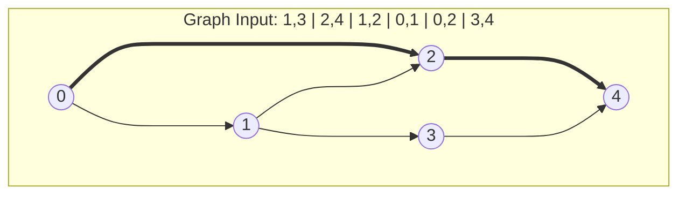

In this series, we want to move beyond just evaluating accuracy or performance and attempts to evaluate process. 
Our question is

> When reasoning models perform a certain reasoning behavior (e.g. backtracking or verification), why do they chose to generate that step?

In another words, we aim to understand the underlying mechanism in these models. A clearer question might be: "What contextual or internal representational shifts trigger self-correction and backtracking behaviors in reasoning models?" 

There could be many answers to this question.
For example, the model might just output a standard backtracking template because it imitated or was rewarded for that **structure** during training, rather than because it actually evaluated and found a flaw in the prior step.

These results might be even different across models (e.g. small vs large models) or training recipes (e.g. distillation vs RL vs mix training). 
Answering this question (even for a specific scenario) could give us insight into mitigating issues such as overthinking (where a model generates thousands of tokens of circular logic without progressing) or enhancing reasoning capability of these models (e.g. under-thinking).

To better understand this question or to get intuitions, we will walk thought several scenarios (in this post and in the next post).

---

**Scenario 1: Mimicking search trace**

> "Search allows models to explore alternative paths, overcoming failures in lookahead tasks by considering multiple possible outcomes before committing to a course of action."

Recent studies in LLM reasoning show that learning to mimic "thinking" processes can enable certain "traits" of reasoning in LLMs <d-cite key="gandhi2024stream"></d-cite>.
In this section, we "approximate" the learning to reasoning with learning to search. 
A reasoning process starts with the initial state which includes axioms or information, and a question. 
At each step, the thinking process transforms to a new state via actions (similar to reasoning behaviors).
The learning objective is to be able to generate intermediate outputs of an algorithmic search procedure. 

Several studies showed that LLMs can learn to mimic the search process and achieve better performance on specific graph search problems.
However, the role of systematic generalization, such as applying trained model on harder problem instances, has yet to be investigated.
In this article, we aim to answer the following questions:
1. How to design the search "trace"?
2. Can GPTs models trained to simulate search algorithms systematically generalize to OOD tasks?
3. What is the role of verifiers?

We study this question by constructing synthetic training and evaluation datasets, training GPT models from scratch, and examining their generalization.

An example of the input is:
$$
\underbrace{1,3|2,4|1,2|0,1|0,2|3,4}_{\text{graph description}}/\underbrace{0,4}_{\text{query}} 
$$
which includes a description of the graph in edge list format and a query (a starting node and a target node). The goal is to find a shortest path from the starting node to the target node.

**Breath-First Search**

In a standard implementation, BFS maintain a queue which keeps track of nodes to expand. 
At the intialization, the queue only includes the starting node.
At each "exploration step", BFS moves to a new node at the end of the queue, adds adjacency nodes to the queue if that node haven't been visited. 
Thus, it also requires an array to keep track of visited nodes.
This procedure continues until the target node is found and a final path is extracted from a backtracking process.

To mimic breath-first search, we construct the following output example: 
$$
\underbrace{<0,(1, 2),1,(2, 3),2,(4) - 4,2,0>}_{\text{Search trace}} \underbrace{0,2,4}_{\text{Final path}}
$$

This BFS's search trace could be divide into 2 parts: (1) the exploration part and (2) the backtracking part. After generating the search trace, the model output a final answer to the problem.
In the search trace above, the *mechanism* of listing adjacency nodes is explicitly revealed while the queue and visited array are implicitly represented. This decomposition of explicit and implicit variables exists in other types of reasoning traces.

Under this format, to be able to perfectly generate a BFS trace, the generative model needs to mimic **the effect of a queue and a visited array**. 

#### Can the model learn this procedure in a systematic generalization manner?
To answer this question, we evaluated models on various graph structure (denoted as $G^{\text{# nodes}}_{\text{length of shortest paths}}$), both in-distribution and out-of-distribution.
It turned out that the model performs near perfect with in distribution data, but fail on OOD inputs.
The scaling trend is also interesting. The ID performance increase with model size while the OOD performance decrease.

<!-- 1. A set of states $\mathcal{S}$, a set of actions $\mathcal{A}$, a transition function $T: \mathcal{S} \times \mathcal{A} \mapsto \mathcal{S}$.
1.  -->

<!-- We select a set of problems related to graphs and train GPT models from scratch to mimic the process of search algorithms on these problems. We first analyze the (systematic) generalization by measuring performance on instances that are harder than those in the training set. Next, we break down the search process into steps and find which steps LLM fails to mimic and generalize. -->

| Model               | $G_{2,4}^{15}$ (ID) | $G_{2,4}^{17}$ (OOD) | $G_{2,4}^{20}$ (OOD) | $G_{5,6}^{15}$ (OOD) | $G_{5,6}^{17}$ (OOD) | $G_{5,6}^{20}$ (OOD) |
|----------------------|--------------|---------------|---------------|---------------|---------------|---------------|
| 3 layers x 4 heads  | 89.21%       | 85.58%        | 85.80%        | **41.53%**    | **40.09%**    | **28.02%**    |
| 3 layers x 8 heads  | _99.70%_     | **98.47%**    | **98.45%**    | 33.53%        | 33.77%        | 24.46%        |
| 6 layers x 4 heads  | 99.53%       | _98.29%_      | _98.29%_      | 35.83%        | 36.45%        | _26.71%_      |
| 6 layers x 8 heads  | 99.45%       | 97.23%        | 96.96%        | _40.09%_      | _39.65%_      | 25.08%        |
| 12 layers x 8 heads | **99.87%**   | 79.40%        | 78.90%        | 36.38%        | 30.54%        | 23.65%        |

To understand how do the GPT models learn the search procedure and how does they fail on OOD samples, we parse the generated search traces and analyze which type of error occurs.
We categorize errors in search traces generated by learned GPT models into the following types:
1. **Error in listing neighbor nodes:** For example, 0,(1, 2), 1,(2, 3) is correct but 0,(1, 2),1,(2, 3, 4) is incorrect since 4 is not a neighbor of 1.
2. **Error in mimicking the queue:** For example, the model could visit a node that is not in a queue.
3. **Error in revisiting:** The model revisit a node that have been expanded before.
4. **Error in tracing back** after the exploration process.

Under this framework, we observe that
1. The model can follow rules of entering and removing from queue
2. However, it fail to correctly list neighboring nodes when the input graphs are larger than those in the training set.
3. Sometimes, model’s intermediate steps are correct but it fails to trace back. For example, it only outputs the last 5 nodes even thought the full path is 6-node length. 

These errors lead to the failure of generalization to OOD graphs.

---

> How does this experiment reveal about the learning to reason in LMs?

A recent work<d-cite key="lippmann2025style"></d-cite> showed that finetuning non-reasoning LMs on stylistically consistent synthetic reasoning traces enhances reasoning performance over the base model. This is actually very similar to training on BFS traces in this experiment.
Moreover, the paper demonstrates that the stylistic patterns present in reasoning traces heavily effect reasoning improvement.

This raise the question of how does these distilled models perform when the problems require extending learned patterns or "unfamilier" patterns? Do they fail similar to those in this experiment? Or can they adapt their reasoning process to the difficulty of questions?

Now, we move the next scenario.
